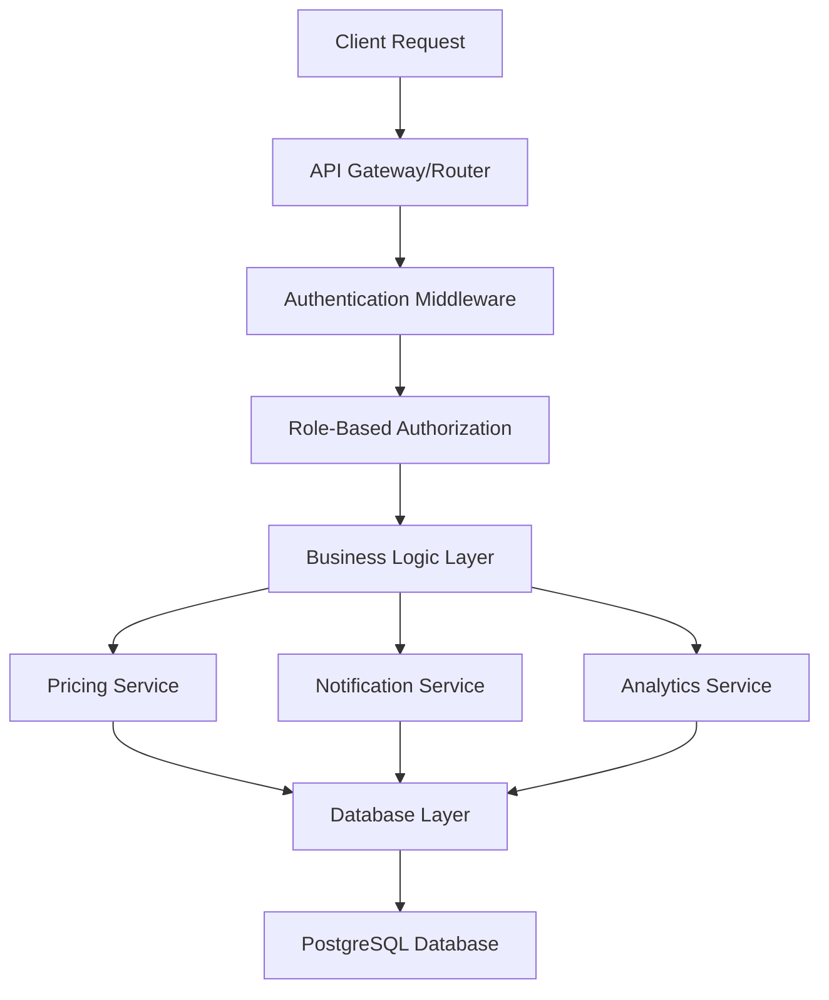

# Design Document

## Overview

This design addresses critical system stability issues affecting all user roles and implements a comprehensive pricing calculation system. The solution focuses on fixing API endpoint failures, implementing role-based pricing calculations, and creating accurate analytics for different user types.

## Architecture

### Current Issues Analysis

Based on the error logs and code review, the main issues are:

1. **500 Internal Server Errors**: Database queries failing due to missing functions or table references
2. **403 Forbidden Errors**: Permission checks failing or missing authorization logic
3. **404 Not Found Errors**: Missing API endpoints or incorrect routing
4. **Pricing Calculation Failures**: Missing integration between pricing tables and assignment creation

### Solution Architecture



## Components and Interfaces

### 1. Enhanced Pricing Service

**Purpose**: Handle all pricing calculations based on user hierarchy and assignment requirements.

**Key Components**:
- `SuperAgentPricingCalculator`: Uses fixed pricing table (£45-£440)
- `AgentPricingCalculator`: Uses agent's custom pricing configuration
- `UrgencyPricingCalculator`: Adds deadline-based charges
- `AnalyticsCalculator`: Computes earnings and fees for each role

**Interface**:
```typescript
interface PricingService {
  calculateAssignmentPrice(wordCount: number, deadline: Date, agentId: string): PricingBreakdown;
  getAgentPricingTable(agentId: string): PricingTable;
  calculateSuperWorkerEarnings(wordCount: number): WorkerEarnings;
  calculateAnalytics(userId: string, role: UserRole): RoleAnalytics;
}
```

### 2. Enhanced API Error Handling

**Purpose**: Provide consistent error responses and prevent cascading failures.

**Components**:
- `ErrorHandler`: Centralized error processing
- `ValidationMiddleware`: Input validation before processing
- `DatabaseErrorHandler`: Specific handling for DB-related errors
- `PermissionValidator`: Role-based access control

### 3. Role-Based Analytics Service

**Purpose**: Calculate earnings, fees, and profits for each user role.

**Components**:
- `SuperAgentAnalytics`: Revenue minus Super Worker fees minus Agent fees
- `AgentAnalytics`: Earnings minus Super Agent fees (including Super Worker costs)
- `SuperWorkerAnalytics`: £6.25 per 500 words in GBP and INR

## Data Models

### Enhanced Pricing Configuration

```sql
-- Super Agent pricing table (fixed)
CREATE TABLE super_agent_pricing (
    word_range_start INTEGER NOT NULL,
    word_range_end INTEGER NOT NULL,
    price_gbp DECIMAL(10,2) NOT NULL,
    created_at TIMESTAMP DEFAULT NOW()
);

-- Agent custom pricing (existing table enhanced)
ALTER TABLE agent_pricing ADD COLUMN IF NOT EXISTS is_active BOOLEAN DEFAULT true;
ALTER TABLE agent_pricing ADD COLUMN IF NOT EXISTS effective_from TIMESTAMP DEFAULT NOW();

-- Project pricing tracking
ALTER TABLE projects ADD COLUMN IF NOT EXISTS pricing_type VARCHAR(20) DEFAULT 'agent'; -- 'super_agent' or 'agent'
ALTER TABLE projects ADD COLUMN IF NOT EXISTS base_price_gbp DECIMAL(10,2);
ALTER TABLE projects ADD COLUMN IF NOT EXISTS urgency_charge_gbp DECIMAL(10,2) DEFAULT 0;
ALTER TABLE projects ADD COLUMN IF NOT EXISTS super_worker_fee_gbp DECIMAL(10,2);
ALTER TABLE projects ADD COLUMN IF NOT EXISTS agent_fee_gbp DECIMAL(10,2) DEFAULT 0;
```

### Analytics Data Model

```sql
-- User earnings tracking
CREATE TABLE user_earnings (
    id SERIAL PRIMARY KEY,
    user_id UUID REFERENCES users(id),
    project_id INTEGER REFERENCES projects(id),
    role VARCHAR(20) NOT NULL,
    earnings_gbp DECIMAL(10,2) NOT NULL,
    earnings_inr DECIMAL(10,2),
    fees_paid_gbp DECIMAL(10,2) DEFAULT 0,
    net_profit_gbp DECIMAL(10,2),
    calculation_date TIMESTAMP DEFAULT NOW()
);
```

## Error Handling

### API Error Response Structure

```typescript
interface APIErrorResponse {
  error: string;
  code: string;
  details?: any;
  timestamp: string;
  path: string;
}
```

### Error Categories

1. **Database Errors (500)**:
   - Missing stored procedures/functions
   - Table/column not found
   - Connection failures

2. **Permission Errors (403)**:
   - Insufficient role permissions
   - Hierarchy access violations
   - Resource ownership issues

3. **Validation Errors (400)**:
   - Missing required fields
   - Invalid data formats
   - Business rule violations

4. **Not Found Errors (404)**:
   - Missing API endpoints
   - Non-existent resources

## Testing Strategy

### Unit Tests
- Pricing calculation accuracy
- Role-based permission validation
- Error handling scenarios
- Currency conversion accuracy

### Integration Tests
- End-to-end assignment creation with pricing
- Multi-role analytics calculations
- API error response consistency
- Database transaction integrity

### User Acceptance Tests
- Client assignment creation flow
- Super Agent analytics dashboard
- Agent earnings calculations
- Super Worker payment tracking

## Implementation Plan

### Phase 1: API Stability Fixes
1. Fix notification endpoint database queries
2. Implement proper error handling middleware
3. Add missing API endpoints
4. Fix permission validation logic

### Phase 2: Pricing System Implementation
1. Create Super Agent pricing table
2. Implement pricing calculation service
3. Update assignment creation flow
4. Add pricing validation

### Phase 3: Analytics Implementation
1. Create role-based analytics calculators
2. Implement earnings tracking
3. Add currency conversion for Super Workers
4. Create analytics dashboards

### Phase 4: Testing and Validation
1. Comprehensive testing of all flows
2. Performance optimization
3. Error scenario validation
4. User acceptance testing

## Security Considerations

### Authentication
- JWT token validation on all endpoints
- Token expiration handling
- Secure token storage

### Authorization
- Role-based access control (RBAC)
- Hierarchy-based permissions
- Resource ownership validation

### Data Protection
- Input sanitization
- SQL injection prevention
- Sensitive data encryption

## Performance Optimization

### Database Optimization
- Index creation for frequently queried columns
- Query optimization for analytics calculations
- Connection pooling configuration

### Caching Strategy
- Pricing table caching
- User role caching
- Analytics result caching

### API Response Optimization
- Pagination for large datasets
- Selective field loading
- Response compression

## Monitoring and Logging

### Error Monitoring
- Centralized error logging
- Real-time error alerting
- Error trend analysis

### Performance Monitoring
- API response time tracking
- Database query performance
- Resource utilization monitoring

### Business Metrics
- Assignment creation success rates
- Pricing calculation accuracy
- User engagement metrics