# User Hierarchy and Reference Code System - Workflow Documentation

## Overview

This document describes how the User Hierarchy and Reference Code System works, including user flows, business processes, and technical workflows.

## Table of Contents

1. [System Architecture Flow](#system-architecture-flow)
2. [User Registration Workflow](#user-registration-workflow)
3. [Hierarchy Management Workflow](#hierarchy-management-workflow)
4. [Project Assignment Workflow](#project-assignment-workflow)
5. [Financial Data Access Workflow](#financial-data-access-workflow)
6. [Notification System Workflow](#notification-system-workflow)
7. [Agent Pricing Workflow](#agent-pricing-workflow)
8. [Error Handling Workflow](#error-handling-workflow)
9. [Development Workflow](#development-workflow)
10. [Deployment Workflow](#deployment-workflow)

## System Architecture Flow

### High-Level System Flow


### Data Flow Architecture


## User Registration Workflow

### New User Registration Process


### Reference Code Types and Hierarchy Assignment

| Code Type | Generated By | Assigns User To | Hierarchy Level |
|-----------|--------------|-----------------|-----------------|
| `client_recruitment` | Agent/Super Agent | Under code owner | Level 3-4 |
| `agent_recruitment` | Super Agent | Under Super Agent | Level 2 |
| `worker_recruitment` | Super Worker/Agent | Under code owner | Level 4-5 |

## Hierarchy Management Workflow

### Hierarchy Structure

```
Level 1: Super Agent (System Administrator)
├── Level 2: Agent (Client Manager)
│   ├── Level 3: Super Worker (Team Lead)
│   │   └── Level 4: Worker (Task Executor)
│   └── Level 3: Client (Project Owner)
└── Level 2: Direct Client (VIP Client)
```

### User Movement in Hierarchy


### Hierarchy Business Rules

1. **Super Agents** cannot be moved
2. **Agents** can only be under Super Agents
3. **Super Workers** can be under Agents or Super Agents
4. **Workers** can be under Super Workers, Agents, or Super Agents
5. **Clients** can be under Agents or Super Agents
6. Maximum hierarchy depth: 5 levels
7. No circular references allowed

## Project Assignment Workflow

### Project Creation and Assignment


### Assignment Types and Rules

| Assignment Type | Who Can Assign | Assigned To | Purpose |
|----------------|----------------|-------------|---------|
| `agent` | Super Agent | Agent | Project management |
| `sub_agent` | Agent | Sub-Agent | Delegation |
| `worker` | Agent/Super Worker | Worker | Task execution |
| `sub_worker` | Super Worker | Worker | Additional support |

### Assignment Validation Process


## Financial Data Access Workflow

### Role-Based Financial Data Access


### Financial Data Filtering Logic

```javascript
// Pseudo-code for financial data filtering
function filterFinancialData(user, data) {
    switch(user.role) {
        case 'super_agent':
            return data; // Full access
            
        case 'agent':
            return data.filter(item => 
                item.agent_id === user.id || 
                isSubordinate(item.user_id, user.id)
            );
            
        case 'super_worker':
            return data.filter(item => 
                item.type === 'worker_payment' &&
                isSubordinate(item.worker_id, user.id)
            );
            
        case 'client':
            return data.filter(item => 
                item.client_id === user.id &&
                item.type === 'pricing'
            );
            
        case 'worker':
            return []; // No financial access
    }
}
```

## Notification System Workflow

### Hierarchy-Aware Notification Delivery


### Notification Types and Routing

| Notification Type | Sender Roles | Recipients | Delivery Method |
|------------------|--------------|------------|-----------------|
| `broadcast` | Super Agent | All users | System-wide |
| `team_update` | Agent/Super Worker | Direct subordinates | Hierarchy-based |
| `project_assignment` | Any with permission | Assigned user | Direct |
| `system_alert` | System | Role-based | Filtered |

## Agent Pricing Workflow

### Pricing Configuration Process


### Pricing Calculation Flow


## Error Handling Workflow

### Comprehensive Error Handling Process


### Error Types and User Experience

| Error Type | User Experience | Recovery Action |
|------------|-----------------|-----------------|
| `VALIDATION_ERROR` | Form validation feedback | Fix input and retry |
| `PERMISSION_DENIED` | Graceful degradation UI | Contact administrator |
| `HIERARCHY_VIOLATION` | Explanation with alternatives | Choose valid option |
| `NETWORK_ERROR` | Retry mechanism | Automatic retry or manual |
| `DATABASE_ERROR` | Generic error message | Contact support |

## Development Workflow

### Feature Development Process

```mermaid
graph TD
    A[Feature Request] --> B[Create Spec]
    B --> C[Requirements Gathering]
    C --> D[Design Document]
    D --> E[Implementation Plan]
    E --> F[Task Breakdown]
    
    F --> G[Database Changes]
    F --> H[Backend Implementation]
    F --> I[Frontend Implementation]
    F --> J[Testing]
    
    G --> K[Migration Scripts]
    H --> L[API Endpoints]
    I --> M[UI Components]
    J --> N[Integration Tests]
    
    K --> O[Code Review]
    L --> O
    M --> O
    N --> O
    
    O --> P[Deployment]
    P --> Q[Production Testing]
    Q --> R[Feature Complete]
```



### Code Quality Workflow

1. **Linting**: ESLint for JavaScript/TypeScript
2. **Type Checking**: TypeScript compilation
3. **Testing**: Unit and integration tests
4. **Code Review**: Peer review process
5. **Security**: Dependency scanning
6. **Performance**: Bundle size analysis

## Deployment Workflow

### Production Deployment Process


### Deployment Checklist

#### Pre-Deployment
- [ ] All tests passing
- [ ] Database migrations ready
- [ ] Environment variables configured
- [ ] SSL certificates valid
- [ ] Backup procedures tested

#### Deployment
- [ ] Database migrations executed
- [ ] Application deployed
- [ ] Health checks passing
- [ ] Monitoring configured
- [ ] Error tracking active

#### Post-Deployment
- [ ] Functionality testing
- [ ] Performance monitoring
- [ ] Error rate monitoring
- [ ] User feedback collection
- [ ] Rollback plan ready

## Business Process Workflows

### Client Onboarding Process

1. **Agent generates client reference code**
2. **Client receives code and registers**
3. **System assigns client to agent's hierarchy**
4. **Agent configures client-specific pricing**
5. **Client gains access to project submission**
6. **Automated project assignment begins**

### Project Lifecycle

1. **Client submits project with requirements**
2. **System calculates pricing using agent's rates**
3. **Agent reviews and approves project**
4. **System assigns workers based on hierarchy**
5. **Workers complete tasks and update status**
6. **Agent reviews and delivers to client**
7. **Financial transactions processed**
8. **Project archived with full audit trail**

### Performance Monitoring Workflow


## Security Workflows

### Authentication Flow
1. User provides credentials
2. System validates against database
3. JWT token generated with user context
4. Token includes role and hierarchy information
5. Token used for subsequent requests
6. Token refresh mechanism for long sessions

### Authorization Flow
1. Extract user context from JWT
2. Check required permissions for endpoint
3. Validate hierarchy relationships if needed
4. Allow or deny access
5. Log access attempts for audit

### Data Protection Flow
1. Identify data sensitivity level
2. Apply role-based filtering
3. Mask sensitive information
4. Log data access
5. Audit trail maintenance

---

**Note**: This workflow documentation should be updated as the system evolves and new features are added.